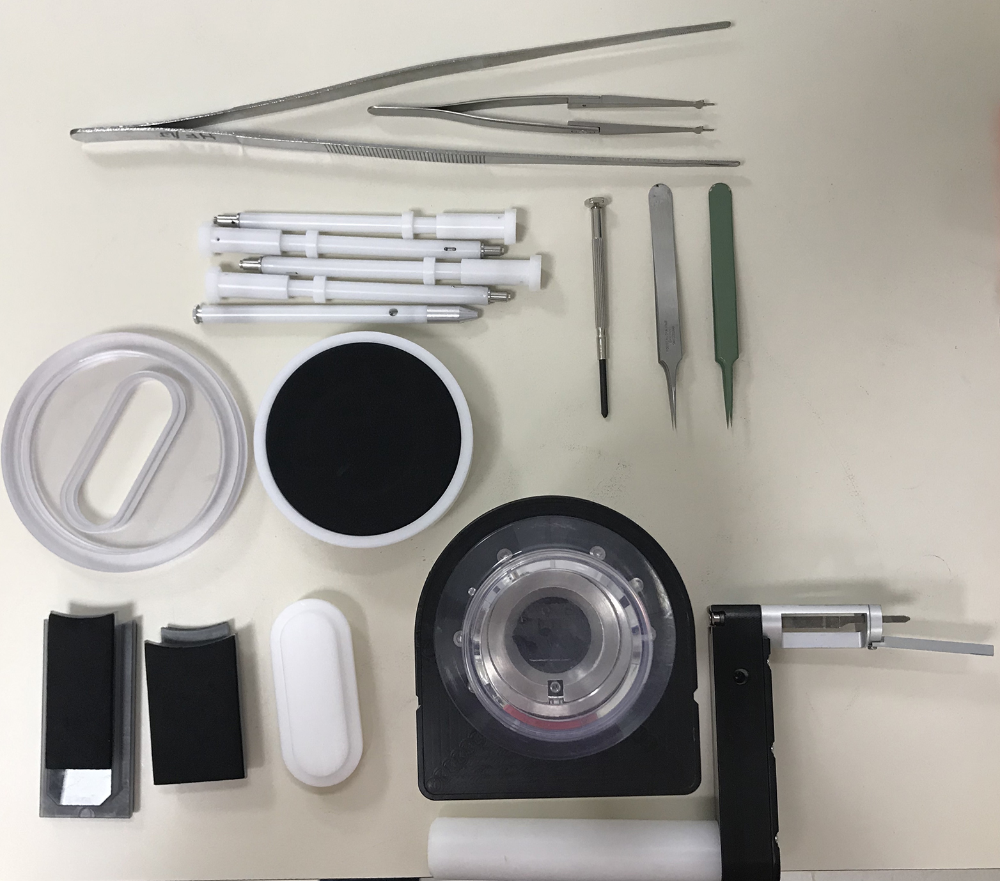
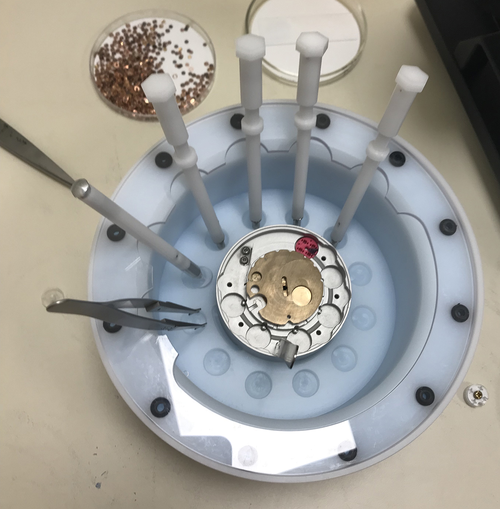
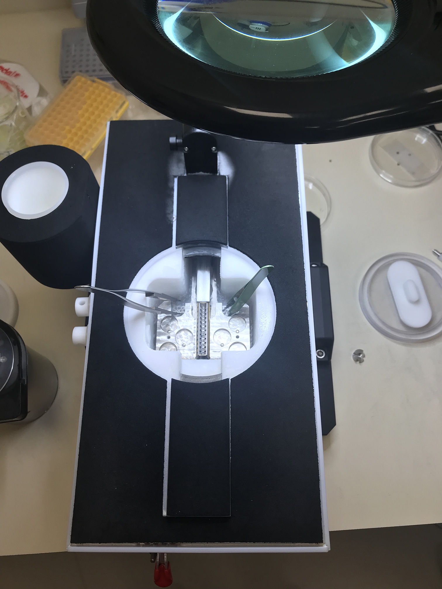

---
authors:
- admin
categories: []
date: "2019-08-21T00:00:00Z"
draft: false
featured: false
image:
  caption: 'Protocol overview and tips for cryo-EM sample preparation'
  focal_point: "top"
  preview_only: false
lastmod: "2019-11-06T00:00:00Z"
projects: [Outreach]
title: 'Cryo-EM Sample Preparation'
subtitle: 'Step-by-step notes for cryo-EM sample preparation and loading  :snowflake:'
summary: Step-by-step notes for cryo-EM sample preparation and loading
tags:
- Cryo-EM
- Instructions
- Protocols
---

## Part I - Sample freezing with the Leica apparatus

### Assemble the necessary tools
<table><tr><td><ul>
	<li>Leica-compatible forceps - These are standard grip, have a black locking clip, and a distal adapter for mounting on the Leica</li>
	<li>Cryogen container for liquid ethane - This is typically stored in the Leica itself, but may be removed to evaporate residual ethane</li>
	<li>Large forceps</li>
	<li>Small forceps</li>
	<li>Grid boxes (color-coded) - Make sure these are empty before beginning!</li>
	<li>Grids - As many as you intend to freeze, plus a couple extra in case of mishaps</li>
	<li>Sample - At working concentration, spun/filtered to remove aggregates</li>
	<li>Small transfer dewar for the Vitrobot & Leica</li>
	<li>A single liquid nitrogen transfer dewar filled with nitrogen</li>
</ul></td></tr></table>

### Prepare the Leica apparatus
<ol>
	<li>Using a 60 mL syringe connected to the luer lock valve on the right of the instrument, fill the humidifier chamber with 90 mL of deionized water.</li>
	<li>Place the following components in the indicated locations within the plunging chamber:
		<ul>
			<li>Cryogen holder for liquid ethane - 12 o'clock</li>
			<li>Grid box reservoir - 4 o'clock - Make sure this is seated properly in place.</li>
			<li>First grid box - in grid box reservior; make sure this is properly seated.</li>
			<li>Additional grid boxes - 6-9 o'clock</li>
			<li>Cryogen holder lid (with tubing connected to the liquid ethane tank below the Leica) - 10 o'clock</li>
		</ul>
	</li>
	<li>Make sure that the grid box screws are loosened and that the grid box holder cover is oriented to allow access to the first slot.</li>
	<li>Fill the nitrogen reservoir (the main part of the chamber).  Nitrogen will seep down through the grating into a larger reservoir.  The reservoir fill and temperature can be monitored on the Leica display.  The goal is to begin with the reservoir full (100%) at a temperature of -180&deg;C.</li>
	<li>Allow the reservoir to equilibrate.  If comforatable, this a good time to glow discharge grids.</li>
	<li>Top off the reservoir such that the nitrogen level is just at the level of the grating.</li>
	<li>Fill the grid box reservoir with nitrogen.</li>
	<li>Fill the cryogen reservoir with ethane.
		<ol type="i">
			<li>Move the cryogen holder lid to cover the cryogen holder</li>
			<li>Make sure to wear eye protection.</li>
			<li>Gently open the outlet valve on the liquid ethane tank. 
			<i>Note: The main tank valve should already be open and the regulator should be already properly adjusted.  In most cases, simply open the black outlet valve.</i></li>
			<li>When the cryogen holder is full, close the outlet valve and carefully remove the cryogen holder cover.</li>
		</ol>
	</li>
	<li>The Leica apparatus is now ready for use.</li>
</ol>

### Glow discharge grids
<ol>
	<li>Check the status of the glow discharge device oil supply.  If more than 1-2 months old, ask for help changing it.</li>
	<li>Carefully place grids on a clean glass coverslip, carbon side up.</li>
	<li>Turn on the glow discharge apparatus.</li>
	<li>Remove the bell jar cover from the apparatus.</li>
	<li>Carefully insert the coverslip with grids onto the discharge platform.</li>
	<li>Replace the bell jar cover.</li>
	<li>Activate the glow discharge chamber.</li>
	<li>When the glow discharge protocol has completed, remove the bell jar cover.</li>
	<li>Carefully remove the coverslip with grids to the desired work surface.</li>
	<li>Replace the bell jar cover for long-term storage.</li>
	<li>Turn off the glow discharge device.</li>
</ol>

### Load grids onto the Leica forceps
<ul>
	<li>Four sets of forceps are ideal as this will let you load an entire grid box at once.</li>
	<li>For left-handed loading (our current setup), load grids carbon side up onto the Leica forceps.</li>
	<li>For right-handed loading, load grids carbon side down.</li>
</ul>

### Apply samples and plunge freeze
<ol>
	<li>If this is the first sample or the blotting paper is spent, install a fresh piece of blotting paper.  It is held in place by a thin, magnetic ring.</li>
	<li>Install one set of the grid-loaded Leica forceps on the loading piston.</li>
	<li>Initialize the loading protocol either with the touch screen or foot pedal.  The humidified chamber should lower into place.</li>
	<li>Using the side-entry port, apply 4 uL of sample to the grid with a pipet.</li>
	<li>Advance the protocol with the foot pedal.  The pre-blotting countdown will begin, after which the blotting and plunging will automatically proceed.</li>
	<li>After plunging, the chamber should raise.  Advance the protocol once more with the foot pedal.  The piston should raise slightly, but the grid should remain submerged in the cryogen.</li>
	<li>Carefully, while maintaining the grid in the liquid ethane, disconnect the forceps from the piston.</li>
	<li>Tightly grip the forceps, and release the black clip. 
		<table><tr><td><b>Pro tip: It is <u>much</u> easier to slide the black clip up of the forceps are gripped from above.  However, be careful not to release the forceps or the grid will be dropped!</b>  I prefer to do the following:
		  
			<ol type="i">
				<li>Grip the forceps tightly, slightly above the black clip.</li>
				<li>While still maintaining pressure, move the black clip upward slightly, just until it is no longer clipped.</li>
				<li>While still maintaining pressure, use your other hand to grip the forceps tightly slightly below the black clip.</li>
				<li>With the first hand, slide the black clip to the top of the forceps.</li>
				<li>The forceps are now ready for transferring the grid to the grid box.</li>
			</ol>
		</td></tr></table>
	</li>
	<li>In one deft motion, move the grid from the cryogen holder to the nitrogen in the grid box reservoir.</li>
	<li>Transfer the grid to the grid box.</li>
	<li>Advance the grid box cover one slot, such that a space is accessible for the next grid.</li>
	<li>Continue applying samples, plunging, and transferring until the grid box is full.</li>
	<li>Rotate the grid box cover such that all slots are fully covered.</li>
	<li>Tighten the grid box cover with a screw driver.</li>
	<li>With forceps, transfer the grid box to the small Leica/Vitrobot transport dewar.</li>
	<li>If freezing additional boxes of grids add additional liquid nitrogen to the grid box reservoir. It is easier if this is done while covering the ethane/cryogen reservoir with its lid, just be sure to remove the lid before continuing.</li>
	<li>Continue as above for all samples. When finished, store the grid boxes in a long-term liquid nitrogen storage dewar.</li>
</ol>

### Clean up
<ol>
	<li>Once all samples have been stored, clean up the area and move all tools to the drying oven.</li>
	<li>Carefully drain the humidifier by opening the valve on the filling tubing.  Allow the humidifier to empty completely.  You may speed this up with the syringe if desired.</li>
	<li>Open the humidifier chamber door.</li>
	<li>Remove and discard the spent blotting paper.</li>
	<li>Very carefully, remove the the cryogen container.  Place it in a safe area for evaporation of the liquid ethane.</li>
	<li>Begin the bake-out protocol.  Ensure that the humidifier chamber door is open during this time.  The bake-out timer will begin counting down once the nitrogen reservoir level has reached zero.</li>
</ol>

---

## Part II - Grid Clipping
### Fill two liquid nitrogen transfer dewars.  Make sure these are dry before beginning.

### Assemble the necessary tools
<table><tr><td>
<ul>
	
	<li>Large forceps</li>
	<li>Flat-T autoloader forceps</li>
	<li>C-clip holder wands (one per grid)</li>
	<li>Rings and C-clips (one per grid; not pictured)</li>
	<li>Screwdriver</li>
	<li>Table-top cryo dewar (and cover) for grid clipping</li>
	<li>Aluminum & brass specimen transfer pedestal (not pictured)</li>
	<li>Cryo-EM grid box(es) (not pictured)</li>
	<li>Cryo-EM grid box top fastener wand(s)</li>
	<li>Funnel (not pictured)</li>
	
</ul>
</td></tr></table>

### Load C-clips into the holder wands.
<ol>
	<li>Use forceps and firm pressure to insert a single C-clip into the wand.</li>
	<li>Make sure that the C-clip is hugging the inside wall of the wand.  Use forceps to adjust if necessary.</li>
	<li>Hold the wand vertically and position it on a flat surface such that the tip of the wand is held firmly against the surface.</li>
	<li>Press down on the wand trigger to engage and align the C-clip at the tip of the wand.</li>
	<li>Inspect proper placement of the C-clip</li>
</ol>

### Prepare the transfer station 
<ol>
	<li>Arrange the transfer setup as pictured.  It should include the specimen transfer pedestal, loaded C-clip wands, and autoloader forceps.</li>
	<li>Additionally, place clip rings (flat-side down) in each of the four mounting positions in the brass portion of the transfer pedestal.</li>
	<li>Inspect each clip ring to make sure that the clip side is face-up.</li>
	<li>Once clip rings are in place, rotate the brass disc such that all clips are covered.  This will ensure they do not move while cooling the station.</li>
	<li>Place cryo-EM grid box(es) on the sample pedestal.  Open them using the grid box fastener wand.  Keep the grid box top attached to the fastner wand until needed.</li>
</ol>

### Recover frozen samples from the storage dewar.  Place them in a styrofoam carrier filled with liquid nitrogen.

### Cool the transfer station
<ol>
	<li>Temporarily remove the wands and forceps from the transfer station.  Place them away from the transfer station to ensure they do not cool (and consequently get condensation on them) while cooling the transfer station (next step).</li>
	<li>Apply the plastic cover to the transfer station.</li>
	<li>Use the large funnel to fill the chamber with liquid nitrogen until the nitrogen level just covers the aluminum portion of the transfer pedestal.
		 <i>Note: Do not cover the brass portion of the pedestal.  If the brass portion does get covered, evaporate the addtional nitrogen by submerging the end of any metal tool into the areas with excess nitrogen.  It should boil off fairly quickly.</i></li>
</ol>

### Clip and transfer grids
<i>Note:  Replace the wands and forceps in the transfer station and allow them to eqilibrate.  While clipping and transferring, keep all tools below the nitrogen level to avoid ice contamination.</i>
<ol>
	<li>Transfer the grid storage box to one well in the specimen transfer pedestal.</li>
	<li>Loosen the top of the grid storage box with a screwdriver</li>
	<li>Make sure that the brass portion of the sample transfer pedestal is aligned such that a clip is accessible in the grid-loading positon.</li>
	<li>With pointed forceps, transfer a single grid to the clip.  Ensure that the grid is centered.</li>
	<li>Using the blunt end of a pair of forceps, rotate the brass portion of the transfer pedestal one notch such that the clip and grid are now in the clipping position.</li>
	<li>Insert a loaded C-clip holder wand into the same, transfer pedestal hole.  Ensure that the wand is at the bottom of the hole, then install the C-clip by ejecting it by pressing on the back end of the C-clip holder wand.</li>
	<li>Return the pedestal to the grid-loading positon.</li>
	<li>
<b>CRITICAL:</b>  Inspect the grid to ensure that the clipping was successful. An improperly-clipped grid can come loose in the microscope and necessitates disassembly of the scope.  You do not want this to happen!
</li>
	<li>Continue as above until all grids have been transferred.</li>
	<li>Fasten the cryo-EM grid box cover using the fastener wand.</li>
	<li>Transfer the loaded cryo-EM grid box to filled stryofoam dewar.</li>
	<li>If any grids remain in the original grid storage box, ensure that the cover is properly oriented, then fasten it with the screwdriver.  These grids can be taken back to the storage dewar.</li>
</ol>

---

## II. Autoloader Cartridge Loading

### Prepare the autoloader cassette transfer station 

<ol>
	<li>Assemble the autoloader transfer station as pictured.  Make sure that the exit hatch cover is in place.</li>
	<li>Make sure to include the cassette ejector wand and cassette (the cassette should be oriented with "1" toward the front)</li>
	<li>Ensure that the cassette is empty and that the orientaiton is correct.  Holder slots should look like the letter "L".</li>
	<li>Make sure the foam and central plastic covers are in place.</li>
	<li>Fill the transfer station until the liquid nitrogen level has just covered the cassette.  A bit extra (1/4") can be added additionally.</li>
	<li>Additionally, fill the autoloader transfer canister with liquid nitrogen.  Ensure that the pin at the top of the canister is mobile by gently pulling up on it.  Once the canister's temperature has equilibrated, cover it.</li>
</ol>

 

### Transfer the clipped grids to the autoloader cassette
<ol>
	<li>Using the cryo-EM box top fastener wand, transfer each cryo-EM grid box to the autoloader cassette transfer station.</li>
	<li>Unscrew the cryo-EM grid box lids and remove them.</li>
	<li>
<b>CRITICAL:</b>  Do not fully load a cassette!  If there is already a grid on the scope, you will be stuck!  Typically, we will leave the first position empty.
</li>
	<li>Using the Flat-T autoloader forceps, transfer each clipped grid to the autoloader cassette.  Each clipped grid should be placed such that is is held in place, just above the bottom of each "L".  It should look like <code>L---&#8515;</code> from above.</li>
	<li>Continue loading all of the clipped grids into the autoloader cassette.</li>
	<li>Once all grids have been loaded, ensure that the autoloader transfer canister (NanoCab) is cool.</li>
	<li>Remove the exit hatch cover and install the autoloader transfer canister.</li>
	<li>Use the cassette holder to grab the autoloader cassette and quickly move it to the canister via the exit hatch.</li>
	<li>Remove the canister from the transfer station.  Ensure that the cassette is properly seated (it should be below the surface of the nitrogen and the pin a the top of the canister should extend.)
</ol>

### Load the cassette into the microscope
<ol>
	<li>Ensure that there is not currently a cassette in the microscope.</li>
	<li>Open the front access panel to the Titan Krios.</li>
	<li>Install the NanoCab canister, curve side first, in the loading position.  The green light should activate.</li>
	<li>Press the green button.</li>
	<li>Wait for the cassette to be loaded.  When the protocol completes, the cassette should be visible through the viewing window and the white button should turn off.</li>
	<li>Remove the NanoCab canister, discard the remaining nitrogen, and place the canister in the drying oven.</li>
</ol>

### Clean up
<ol>
	<li>Return to the autoloader cassette transfer station.</li>
	<li>Carefully remove all of the components, discard the remaining nitrogen, and place all tools and the transfer station itself in the drying oven.</li>
	<li>Inspect the rest of the work area.  Discard any additional trash and return all tools and supplies to their rightful storage locations.</li>
</ol>
 