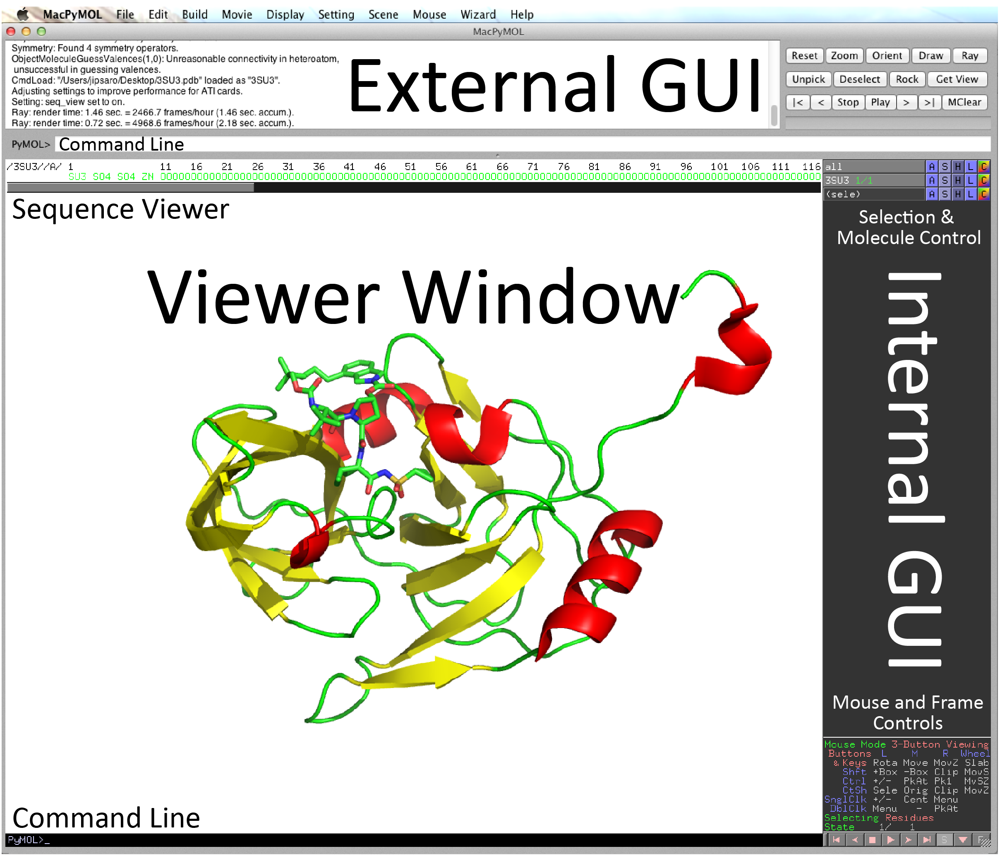

---
authors:
- admin
categories: []
date: "2019-11-01T00:00:00Z"
draft: false
featured: false
image:
  caption: 'Handouts and resources for the PyMOL tutorial'
  focal_point: "top"
  preview_only: false
lastmod: "2019-11-01T00:00:00Z"
projects: [Outreach]
title: 'PyMOL Tutorial 2018'
subtitle: 'Understand .pdb files and make molecular graphics  :computer:'
summary: Understand .pdb files and make molecular graphics
tags:
- Outreach
- PyMOL
- PDB
- Featured
---

## Overview
I have instructed PyMOL tutorials numerous times for first year graduate students (and even occasional faculty members!).  Course materials can be found in the downloads.  An outline of the course contents is also provided.

----------
----------

## Tutorial Downloads
<ul>
<li><a href="PyMOL_Tutorial_2018.docx">Tutorial Documentation - MS Word</a></li>
<li><a href="PyMOL_Practice.docx">Practice Questions - MS Word</a></li>
<li><a href="PyMOL_Practice.pse">Practice Question - PyMOL Session (Finished)</a></li>
<li><a href="PyMOL_Quiz_2018.docx">Quiz - MS Word</a></li>
</ul>

----------
----------
## Workshop Notes
### What PyMOL does and does not do:
<ul>
  <li>PyMOL is a molecular graphics program that is primarily designed for producing publication-quality illustrations and animations.</li>
  <li>In its purest form, PyMOL is NOT used for molecular modeling, structure manipulation, or <i>in silico</i> experiments.</li>
  <li>PyMOL is user-sponsored but runs on an open source platform.</li>
</ul>

### About the PDB file format
<ul>
  <li>The main file format you will use with PyMOL has the extension .pdb (Protein Data Bank).</li>
  <li>PDB files are <b>plain text</b> documents and have a straightforward and consistent structure.  The <b>spacing</b> of entries is critical to the file being read properly.</li>
</ul>

<table>
<tr><th>Line Identifier</th><th>Description</th></tr>
<tr><td>Title</td><td><i>Name of the entry</i></td></tr>
<tr><td>Remarks</td><td><i>Descriptors for everything used in the project.  This includes biological, chemical, physical, crystallographic, refinement, and processing parameters.</i></td></tr>
<tr><td>CRYS1 card</td><td><i>Unit cell dimensions for the crystal</i></td></tr>
<tr><td>Origin and Scale Cards</td><td><i>Sets the coordinate system</i></td></tr>
<tr><td>ATOM entries</td><td><i>Coordinates (see below)</i></td></tr>
<tr><td>ANISOU entries</td><td><i>Optional anisotropic temperature factor line</i></td></tr>
<tr><td>Terminators (TER, END)</td><td><i>Indicates the end of chains or the end of the file</i></td></tr>
</table>

<ul>
  <li>The <b>bare minimum</b> .pdb file has a CRYS1 card and atom entries.</li>
  <li>Each ATOM entry has several parameters (in order):
    <ul>
    <li>atom card</li>
    <li>atom number</li>
    <li>atom identity</li>
    <li>amino acid identity</li>
    <li>chain identity</li>
    <li>amino acid number</li>
    <li>x, y, z, coordinates</li>
    <li>occupancy (0.00-1.00)</li>
    <li>temperature factor (B-factor)</li>
    <li>atomic element</li>
    </ul>
  </li>
</ul>

### The PyMOL Interface
<ol>
  <li>Both GUI and command line driven</li>
  <li>Has two GUIs (External and Internal):
    <ul>
      <li>The <b>external</b> GUI is used for rendering images, creating animations, and controlling many of PyMOL’s settings.</li>
      <li>The <b>internal</b> GUI is used for controlling exactly what objects and elements are displayed, how they are colored, and how they are positioned.</li>
      <li><i>Think of PyMOL as a photo shoot.  The internal GUI controls what your model is wearing and how the subject is positioned.  The external GUI controls the settings on your camera.</i></li>
    </ul>
  </li>
</ol>



### Opening Files
<ul>
  <li>Option 1:  Go to <a href="http://www.pdb.org/">www.pdb.org</a> and find the PDB file you would like.  Download the coordinates.  Then use <code>File >> Open</code> to browse and open the file.</li>
  <li>Option 2:  Use the command line.  Simply type <code>fetch</code> followed by the PDB code.
  </li>
</ul>

```python
fetch 3SU3
```

### Internal GUI Controls:
<ol>
  <li>Change molecular orientation (mouse controls)
    <table>
      <tr><th>Mouse Button</th><td>Left</td><td>Middle</td><td>Right</td><td>Wheel</td></tr>
      <tr><td>Drag</td><td>Rotation</td><td>Move</td><td>Zoom</td><td>Slab</td></tr>
      <tr><td>Click</td><td>Pick Atom</td><td>Center</td><td>Menu</td><td></td></tr>
    </table>
  Note: These are also indicated in the lower-right corner of the internal GUI window.
  </li>

  <li>Changing the appearance of molecules or selections - There are 5 main buttons next to each element:<br>
    <table>
      <tr><td>A</td><td>Actions</td></tr>
      <tr><td>S</td><td>Show (display the selection in a certain way, i.e. 'cartoon', 'surface', etc.)</td></tr>
      <tr><td>H</td><td>Hide (hide certain selection features that are currently displayed)</td></tr>
      <tr><td>L</td><td>Label</td></tr>
      <tr><td>C</td><td>Color</td></tr>
    </table>
  </li>

  <li>Selecting molecules, chains, atoms, or regions can be accomplished either through the command line or by pointing and clicking.  Here are the three most useful ways I like:
  <ol type='a'>
    <li>Click on the residue of interest.  You will see that a (sele) object has been created in the internal GUI.  You can rename this object and PyMOL will remember the selection in the future.  The selection can be edited later as well.</li>
    <li>Use the external GUI can click <code>Display >> Sequence On</code>.  This will show you the amino acid sequence of the structure.  You can select residues by clicking on them.</li>
    <li>Use the <code>select</code> command line command.  This command is very powerful, but may take some time to get the hang of.</li>
  </ol>
</ol>

```python
#This will select chain A and name it “mychain”
select mychain, chain A
```

```python
#This will select all c, o, n, and alpha-carbon atoms and name the selection “certainatoms”
select certainatoms, name c+o+n+ca	
```

```python
#This will select everything that is both in a selection named “file1” and annotated as chain B. Note that there is no comma in this command.
select file1 and chain B
```

```python
#This will select everything that is both in a selection named “file1” and annotated as chain B and then name the selection “file1chainB”
select file1chainB, file1 and chain B
```

<ol start='4'>
  <li>Distances and angles can be measured using the measurement wizard.  The wizard can be found under <code>Wizard >> Measurement</code>.
    <ol type='a'>
      <li>To measure distances, you will simply need to click each atom.  After clicking the second atom, a dashed line and distance (in Angstroms) will appear.</li>
      <li>To measure angles, you will need to first change the measurement mode from <code>Distances</code> to <code>Angles</code> in the lower right corner of the internal GUI.  Then click on three atoms.  The angle will be displayed.</li>
    </ol>
  </li>

  <li>Other useful display features:
    <ol type='a'>
      <li>Electrostatics can be generated using the <code>Action</code> button for an object.  Simply click <code>Action >> generate >> vacuum electrostatics</code>.  Note that these are rather quick-and-dirty (i.e. not publishable) but can give a nice approximation of the electrostatic surface.  For a publishable electrostatic surface, plug-ins are required such as APBS.</li>
      <li>Symmetry-related molecules can also be generated using the <code>Action</code> button.  This is particularly useful if a molecule adopts a symmetric structure that is coincident with a crystallographic axis.  Click <code>Action >> generate >> symmetry mates</code> and select a distance  (5 Å is usually good enough).  You can then hide the molecules that you are not interested in (or delete them altogether)</li>
    </ol>
  </li>
  
  <li>Alignment
    <ol type='a'>
      <li>One of the most useful features that PyMOL boasts is a native three-dimensional alignment algorithm.</li>
      <li>Alignment of two objects can be performed simply using the <code>align</code> -or- <code>super</code> command line commands.</li>
      <li>Note that alignments can be performed between entire structure depositions, specific chains, or even selected residues.  Define your selection (described above), name them, and use the align command to superpose one molecule onto the other.</li>
    </ol>
  </li>
</ol>

```python
#This command attempts to move the entire PDB coordinates of PDB1 onto PDB2. This would work well for two homologous structures with one copy in the asymmetric unit
align PDB1, PDB2
```

```python
#Alternatively, the super command can be used.  The results may be slightly different.
super PDB1, PDB2
```

```python
#This command moves the molecule that selection1 “belongs” to onto the molecule that selection2 “belongs” to using only selection1 and selection2 to calculate the alignment. This is useful (for example) if you have two distantly-related proteins with conserved active sites.  You could select the active site residues of each, name them, and then align the molecules based only on the important residues.align PDB1, PDB2
align my_selection1, my_selection2		
```

### External GUI Controls:
<ol>
  <li>Changing the background, general appearance, and rendering options can be accomplished using the eternal GUI Setting menu.  These are pretty straightforward.</li>
  <li>Ray tracing will provide you with high resolution images.  There are two options to initiate a ray trace: you can use the external GUI or the command line.
    <ol type='a'>
      <li>If using the external GUI, click the <code>Ray</code> button at the top right corner of the GUI.</li>
      <li>The command line can also be used.  The command line affords more flexibility in outputting an image of defined size.</li>
    </ol>
  </li>
</ol>

```python
#Ray traces the current view at 2400 x 3600 pixels
ray 2400,3600
```

<ol start='3'>
  <li>Saving images can be accomplished at any time by using the selecting <code>File >> Save Image As</code> in the external GUI.  Alternatively, the command line can be used as below.</li>
</ol>

```python
#Save the current view as MyImage.png
png MyImage.png
```
<ol start='4'>
  <li>Saving your PyMOL session can also be accomplished at any time by selecting <code>File >> Save Session As</code>.  This is very useful as it will allow you to edit your work in the future.</li>
</ol>

### Other things to note:
<ul>
  <li>PyMOL has a very powerful scripting language.  Everything that can be done with the GUI can be done by the command line (and more!).   Scripting allows you to either save your commands as you execute them or just write code from scratch.  This is invaluable when the same actions need to be performed repetitively or when something very minor changes in your coordinate.</li>
  <li>There are many other graphics programs, but PyMOL seems to be the most popular.  Other programs that you may hear about include RasMOL, Raster3D, MolScript, Chimera, etc.  With cryoEM data becoming more and more prevalent, Chimera is especially becoming a more popular tool in the field.</li>
</ul>

### Useful links:
>http://www.rcsb.org	- For downloading publicly-available coordinate files <br>
http://pymolwiki.org - A great resource on how to use PyMOL <br>
http://www.pymol.org - The PyMOL homepage <br>